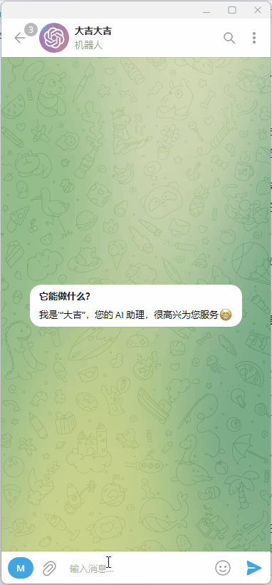

# 自己部署

## 1. 安装 wranger
```shell
npm install -g wrangler
```
## 2. 登录
```shell
wrangler login
```
## 3. 创建kv
不需要修改
```
wrangler kv:namespace create UserData
```
执行完后会出现类似一个这样的结果，一会修改配置文件用。
```toml
kv_namespaces = [
  { binding = "UserData", id = "95a3d5bfe5d747b0a91ef0150b810de3" }
]
```

## 4. 修改配置文件
修改 `wrangler.exmaple.toml` 为 `wrangler.toml`，修改如下内容
```
kv_namespaces = [
  { binding = "UserData", id = "替换上一步的结果" }
]

...
[vars]
SECRET_TOKEN = "openai密钥"
TELEGRAM_API_KEY = "telegram机器人api key"
```

## 5. 发布
```
wrangler publish
```

## 6. 配置 telegram bot
### 6.1 创建自己的机器人
使用 [@BotFather](https://t.me/BotFather)创建，会拿到上面的 api key。

命令设置，使用 `/setcommands` 命令
```
chat - 随便聊
translate - 翻译
interview - 面试
commands - 指令库
contact - 联系我

```
### 6. webhook设置
2. 进入 Cloudflare Workers 中找到 telegram-chatgpt 项目，复制该 Workers 的地址。
3. 设置webhook,替换[]内容，修改会访问下该地址即可。
```
https://api.telegram.org/bot[api key]/setWebhook?url=[worker地址]
```

## 结束
有什么问题可以联系我telegram 联系我 @evanmiao，也可以提 Issue。


